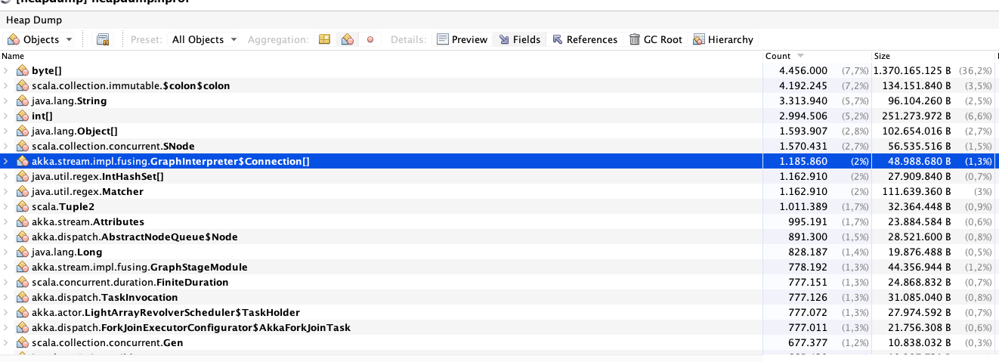

# Memory leak analysis

### Tools required

- [jcmd](https://docs.oracle.com/javase/8/docs/technotes/guides/troubleshoot/tooldescr006.html) is used for multiple tasks
  such as taking heapdumps, print threads along with stack traces, etc... 
  __It was working fine, but now getting Permission denied__ for `GC.heap_dump` rest are working
  
  ```
    sudo -u <user-id> jcmd <pid> GC.heap_dump heapdump.hprof (not working)
    sudo -u <user-id> jcmd <pid> GC.heap_info
    sudo -u <user-id> jcmd <pid> Thread.print
  ```
  `user-id` with which processing is running.
  
- [jmap](https://docs.oracle.com/javase/7/docs/technotes/tools/share/jmap.html) is another tool to take heap dumps
  
  ```
    sudo -u <user-id> jmap -dump:file=./heapdump.hprof <pid>
  ```

- [VisualVM](https://visualvm.github.io/) is used to analyze heap dumps
  - VisualVM can be used to analyze above taken heap dumps 
  - VisualVM can also be used to attach to existing PID if JMX is enabled
     - create a ssh tunnel
     - connect to local port using jmx


- With AkkaHttp 10.0.13 and Akka 2.4.20 combination, Source.queue left some garbage which is not cleaned 

- `pmap` is useful command how much OS allocated memory to particular process, for example 

```shell
sudo pmap 7056
sudo pmap -x 7056
sudo pmap -X 7056
sudo pmap -XX 7056
```
In the output, you can see total memory allocated , maybe it is good to mention explicit stack size with 
`-Xss1m` 1 MB is default value

- Following code caused memory leak

```scala
val (streamPublisher, pub) = Source
      .actorRef[AkkaStreamerResponse](16, OverflowStrategy.fail)
      .withAttributes(Attributes.name("mystream-publisher"))
      .toMat(Sink.asPublisher(fanout = true))(Keep.both)
      .run()

createActor(streamPublisher) ! StartStreaming
```

#### Theory for memory leak

when ever I want to tear down streaming connection from server point of view, sending `Success` message to `streamPublisher`
but in some cases I am not getting `Terminated` message (I am watching `streamPublisher`). Maybe some times message might lose 
on either side (`Success` or `Terminated`) so implemented retry mechanism

```scala
streamPublisher ! Status.Success(Done)
```

#### Retry mechanism with kill switch

I am not sure KillSwitch is required or not

```scala
val ((streamPublisher, killSwitch), pub) = Source
        .actorRef[AkkaStreamerResponse](16, OverflowStrategy.fail)
        .withAttributes(Attributes.name("mystream-publisher"))
        .viaMat(KillSwitches.single)(Keep.both)
        .toMat(Sink.asPublisher(fanout = true))(Keep.both)
        .run()


createActor(streamPublisher, killSwitch) ! StartStreaming

class MyActor(streamPublisher: ActorRef, killSwitch: KillSwitch) extends Actor {
  // Not that important code here ...
  def shutdown(remainingRetries: Int): Receive = handleActorTerminations orElse {
    case Shutdown if remainingRetries <= 0 => cleanUp()
    case Shutdown =>
      context.watch(streamPublisher)
      streamPublisher ! Status.Success(Done)
      context.system.scheduler.scheduleOnce(5.seconds, self, Shutdown)
      context.become(shutdown(remainingRetries - 1))
  }

  private def shutdownStreamerWithRetry(): Unit = {
    streamPublisher ! Status.Success(Done)
    context.become(shutdown(10))
    self ! Shutdown
  }

  private def cleanUp(): Unit = {
    killSwitch.shutdown()
    self ! PoisonPill
  }

  // Not that important code here ...
  
}
```

- Still low memory alters are coming so enabled `-XX:NativeMemoryTracking=detail` and collecting memory details every 10 seconds with `./native-memory` script

### Useful commands 

- Take only live heap dump (before taking heap dump full GC will be triggered) 

```shell
sudo jmap -dump:all,format=b,file=/tmp/heapdump.hprof $pid
```

- `jcmd` with optional `-all` dumps all objects, including unreachable objects

### Resources

- [jmap](https://docs.oracle.com/en/java/javase/11/tools/jmap.html#GUID-D2340719-82BA-4077-B0F3-2803269B7F41) documentation
- [jcmd](https://docs.oracle.com/en/java/javase/14/docs/specs/man/jcmd.html) documentation
- [jcmd dzone blog](https://dzone.com/articles/jcmd-one-jdk-command-line-tool-to-rule-them-all)
- [AkkaHttp Memory leak](https://github.com/akka/akka-http/issues/1637) looks interesting, but it is with `10.0.11` and 
  `akka-2.5.7`, in my case my akka http version is `10.0.13` and `akka-2.4.20`
- [Java command line options](https://docs.oracle.com/en/java/javase/11/tools/java.html#GUID-3B1CE181-CD30-4178-9602-230B800D4FAE)
