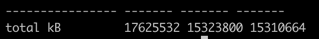

# Memory leak analysis

### Tools required

- [jcmd](https://docs.oracle.com/javase/8/docs/technotes/guides/troubleshoot/tooldescr006.html) is used for multiple tasks
  such as taking heapdumps, print threads along with stack traces, etc... 
  __It was working fine, but now getting Permission denied__ for `GC.heap_dump` rest are working
  
  ```
    sudo -u <user-id> jcmd <pid> GC.heap_dump heapdump.hprof (not working)
    sudo -u <user-id> jcmd <pid> GC.heap_info
    sudo -u <user-id> jcmd <pid> Thread.print
  ```
  `user-id` with which processing is running.
  
- [jmap](https://docs.oracle.com/javase/7/docs/technotes/tools/share/jmap.html) is another tool to take heap dumps
  
  ```
    sudo -u <user-id> jmap -dump:file=./heapdump.hprof <pid>
  ```

- [VisualVM](https://visualvm.github.io/) is used to analyze heap dumps
  - VisualVM can be used to analyze above taken heap dumps 
  - VisualVM can also be used to attach to existing PID if JMX is enabled
     - create a ssh tunnel
     - connect to local port using jmx


- With AkkaHttp 10.0.13 and Akka 2.4.20 combination, Source.queue left some garbage which is not cleaned 

- `pmap` is useful command how much OS allocated memory to particular process, for example 

```shell
sudo pmap 7056
sudo pmap -x 7056
sudo pmap -X 7056
sudo pmap -XX 7056
```
In the output, you can see total memory allocated , maybe it is good to mention explicit stack size with 
`-Xss1m` 1 MB is default value

- Following code caused memory leak

```scala
val (streamPublisher, pub) = Source
      .actorRef[AkkaStreamerResponse](16, OverflowStrategy.fail)
      .withAttributes(Attributes.name("mystream-publisher"))
      .toMat(Sink.asPublisher(fanout = true))(Keep.both)
      .run()

createActor(streamPublisher) ! StartStreaming
```

#### Theory for memory leak

when ever I want to tear down streaming connection from server point of view, sending `Success` message to `streamPublisher`
but in some cases I am not getting `Terminated` message (I am watching `streamPublisher`). Maybe some times message might lose 
on either side (`Success` or `Terminated`) so implemented retry mechanism

```scala
streamPublisher ! Status.Success(Done)
```

#### Retry mechanism with kill switch

I am not sure KillSwitch is required or not

```scala
val ((streamPublisher, killSwitch), pub) = Source
        .actorRef[AkkaStreamerResponse](16, OverflowStrategy.fail)
        .withAttributes(Attributes.name("mystream-publisher"))
        .viaMat(KillSwitches.single)(Keep.both)
        .toMat(Sink.asPublisher(fanout = true))(Keep.both)
        .run()


createActor(streamPublisher, killSwitch) ! StartStreaming

class MyActor(streamPublisher: ActorRef, killSwitch: KillSwitch) extends Actor {
  // Not that important code here ...
  def shutdown(remainingRetries: Int): Receive = handleActorTerminations orElse {
    case Shutdown if remainingRetries <= 0 => cleanUp()
    case Shutdown =>
      context.watch(streamPublisher)
      streamPublisher ! Status.Success(Done)
      context.system.scheduler.scheduleOnce(5.seconds, self, Shutdown)
      context.become(shutdown(remainingRetries - 1))
  }

  private def shutdownStreamerWithRetry(): Unit = {
    streamPublisher ! Status.Success(Done)
    context.become(shutdown(10))
    self ! Shutdown
  }

  private def cleanUp(): Unit = {
    killSwitch.shutdown()
    self ! PoisonPill
  }

  // Not that important code here ...
  
}
```

- Still low memory alters are coming so enabled `-XX:NativeMemoryTracking=detail` and collecting memory details every 10 seconds with `./native-memory` script

### Install jemalloc

jemalloc is better memory allocator than `malloc`

- Download the latest version https://github.com/jemalloc/jemalloc/releases/download/5.2.1/jemalloc-5.2.1.tar.bz2
- Unzip, configure and make (if there is no gcc install with yum install gcc ... )
- `.so` can be found in `lib` directory

```shell
cd jemalloc-5.2.1
./configure --enable-prof & make
cp lib/libjemalloc.so.1 /usr/lib64/
ln -s /usr/lib64/libjemalloc.so.1 /usr/lib64/libjemalloc.so
export LD_PRELOAD=/usr/lib64/libjemalloc.so
export MALLOC_CONF="prof:true,prof_prefix:jeprof.out,lg_prof_interval:30"
```

### Useful commands 

- Take only live heap dump (before taking heap dump full GC will be triggered) 

```shell
sudo jmap -dump:all,format=b,file=/tmp/heapdump.hprof $pid
```

- `jcmd` with optional `-all` dumps all objects, including unreachable objects

# Conclusion

## Problem & Solution

I am very happy to fix this memory leak issue, there were so many suspects on the way but none of the suspects caused the issue. 
In short, the problem is, OS says a process is using too much memory (`pmap -x`) but jvm says it is not using 
memory (`jcmd 30284 VM.native_memory`). Then I came to know about allocator issue which is mentioned in the 
[stackoverflow answer](https://stackoverflow.com/questions/53451103/java-using-much-more-memory-than-heap-size-or-size-correctly-docker-memory-limi) 
gave me more insight about the memory allocation. I am not aware of the memory allocator issue. It seems there is a problem with `malloc`, 
it requests big chunks of memory (64 MB) which lead to fragmentation and excessive memory usage. Based on the suggestion I build `jemalloc` and 
exported `LD_PRELOAD` as environment variable. Then things started working better, thanks to `Andrei Pangin` for his stackoverflow answer and [talk](https://vimeo.com/364039638).


```shell
export LD_PRELOAD=/usr/lib64/libjemalloc.so
export MALLOC_CONF="prof:true,prof_prefix:jeprof.out,lg_prof_interval:30"
```

## Bonus 

  In the process I found there are some streaming actors are not closed properly so introduced retry mechanism with kill switch (code blocks are in the same page above). 
I am not sure it is good practice or not, but it works. I do not see those actors anymore. How will I know it is good practice or not?
 
  I do not think this is main issue, it is kind of bonus.

## Approach to solve the problem

- Took `heapdump` and try to analyse with VisualVM, could not find any issue in the heap 
- With port forwarding connected remote jvm process to VisualVM for better insights and hoped to find something 
- With `pmap` confirmed that issue is in the same process. Other process are not causing memory leak
- Thought bytebuffers causing the problem, but they are not
- Used [jxray](https://jxray.com/download) for better heap analysis, it pointed me to potential memory leak, but it is not. 
  But in the process I found few actors were not closed properly fixed them.
- Suspected jvm arguments and try to tweak them a bit
- For sure, I thought native memory is causing the issue so enabled NMT and took periodically NMT metrics, but I could not see anything fishy
- Finally with the help of [stackoverflow answer](https://stackoverflow.com/questions/53451103/java-using-much-more-memory-than-heap-size-or-size-correctly-docker-memory-limi) 
  and [Andrei talk](https://vimeo.com/364039638) I found that `malloc` has on impact on RSS as well not just increase virtual address space. Used `jemalloc` to fix the issue

## Installation of jemalloc

```shell
wget https://github.com/jemalloc/jemalloc/releases/download/3.0.0/jemalloc-3.0.0.tar.bz2
tar xjf jemalloc-3.0.0.tar.bz2
cd jemalloc-3.0.0
sudo yum install gcc --assumeyes
./configure --enable-prof
make
cp lib/libjemalloc.so.1 /usr/lib64/
ln -s /usr/lib64/libjemalloc.so.1 /usr/lib64/libjemalloc.so
```

### Resources

- [jmap](https://docs.oracle.com/en/java/javase/11/tools/jmap.html#GUID-D2340719-82BA-4077-B0F3-2803269B7F41) documentation
- [jcmd](https://docs.oracle.com/en/java/javase/14/docs/specs/man/jcmd.html) documentation
- [jcmd dzone blog](https://dzone.com/articles/jcmd-one-jdk-command-line-tool-to-rule-them-all)
- [jemalloc](https://github.com/jemalloc/jemalloc)
- [AkkaHttp Memory leak](https://github.com/akka/akka-http/issues/1637) looks interesting, but it is with `10.0.11` and 
  `akka-2.5.7`, in my case my akka http version is `10.0.13` and `akka-2.4.20`
- [Java command line options](https://docs.oracle.com/en/java/javase/11/tools/java.html#GUID-3B1CE181-CD30-4178-9602-230B800D4FAE)
- [Memory Footprint of a Java Process by Andrei Pangin](https://vimeo.com/364039638) very good talk
- [Stack over flow with nice explanation](https://stackoverflow.com/questions/53451103/java-using-much-more-memory-than-heap-size-or-size-correctly-docker-memory-limi)
- [jhiccup](https://github.com/giltene/jHiccup)
